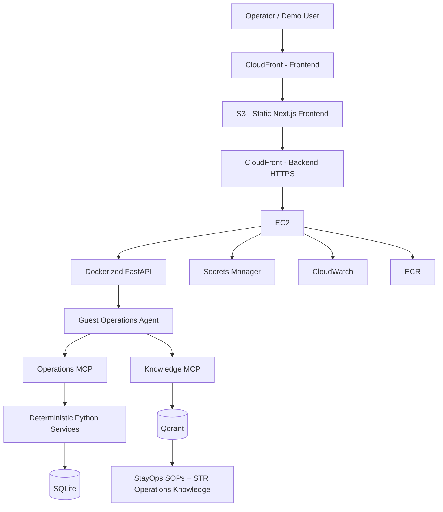

# StayOps AI

StayOps AI is an autonomous guest-operations system for short-term-rental teams. It is designed to do more than generate guest replies: it retrieves operational context, uses company knowledge, takes bounded actions through tools, verifies resulting state, and escalates safely when human intervention is required.

**Live demo:** https://d8hbj9y50bgwb.cloudfront.net

---

## What the system demonstrates

StayOps is built around a simple principle:

> **Use AI for ambiguity. Use normal software for certainty.**

The LLM handles interpretation, context selection, reasoning, and tool choice. Deterministic application code handles state changes, validation, idempotency, permissions, and database operations.

A guest issue can therefore move through a workflow like:

```text
Guest message
    ↓
Guest / booking / property lookup
    ↓
Operational knowledge retrieval
    ↓
Agent decision
    ↓
Bounded tool execution
    ↓
Task / escalation / message state change
    ↓
Operational verification
    ↓
Guest response
```

The project intentionally uses **one Guest Operations Agent** rather than a multi-agent architecture. Additional agents would only be introduced when a genuinely separate responsibility boundary appears.

---

## Example workflows

### Worsening plumbing leak

The agent can:

- retrieve the guest, reservation, and property context
- retrieve the relevant plumbing SOP
- provide safe guest guidance
- create or reuse a plumbing task
- create or reuse a high-priority plumbing escalation
- record the guest message
- return a clear response

### Heating failure

The agent can:

- retrieve heating guidance
- provide safe thermostat-level troubleshooting
- avoid unsafe equipment instructions
- create a heating task
- escalate when the situation requires human attention

### Refund request

The agent cannot approve, promise, calculate, or issue a refund.

Instead it:

- continues handling the underlying operational issue
- creates a separate refund escalation
- leaves the financial decision to an authorized human

This demonstrates a core design rule:

> **Escalation is a successful outcome when autonomous action would be unsafe or unauthorized.**

---

## Multi-guest demo

The UI includes three synthetic demo guests:

| Guest | Language |
|---|---|
| Emma Carter | English |
| Liliane Bavaud | French |
| Lukas Weber | German |

Language comes from the guest profile rather than a manual UI switch.

Operational state is isolated by booking, so tasks, escalations, and messages for one guest do not appear for another.

---

## Architecture



### AWS deployment

The deployed system uses:

- **ECR** for versioned backend container images
- **EC2** for the Dockerized FastAPI + agent runtime
- **S3** for the statically exported Next.js frontend
- **CloudFront** for frontend delivery and backend HTTPS
- **IAM roles** for workload permissions
- **Secrets Manager** for the OpenAI API key
- **CloudWatch** for runtime logs and operational visibility
- **Systems Manager** for instance administration
- **Terraform** for infrastructure as code

The backend EC2 instance is not given developer AWS credentials. It receives an IAM role with only the permissions required by the workload.

---

## Context and retrieval strategy

StayOps separates current operational state from reusable operational expertise.

### SQL: current truth

SQLite stores structured state such as:

- guests
- reservations
- properties
- tasks
- escalations
- incidents
- guest messages
- access configuration

### Qdrant: reusable expertise

Qdrant stores operational knowledge such as:

- plumbing procedures
- heating procedures
- refund handling
- short-term-rental operational guidance
- StayOps-specific SOPs

A useful mental model is:

> **SQL tells the agent what is true now. RAG tells the agent how to handle it.**

Internal StayOps SOPs are treated as authoritative and take precedence over broader retrieved operational guidance.

The Qdrant knowledge tool is read-only during agent execution.

---

## MCP and tool boundaries

The agent does not receive unrestricted database access.

Instead, operational capabilities are exposed through MCP tools such as:

- `lookup_guest`
- `lookup_reservation`
- `lookup_property`
- `lookup_access_system`
- `lookup_open_incidents`
- `check_guest_access_permission`
- `ensure_operations_task`
- `ensure_human_escalation`
- `message_guest`

This keeps database writes and business rules behind deterministic Python services.

> **The agent gets tools, not unlimited power.**

---

## Idempotency

Repeated guest messages should not create duplicate operational work.

If the same plumbing problem is reported twice, StayOps reuses the existing open task and escalation instead of creating duplicates.

The deterministic service layer checks:

```text
booking + property + category + open status
```

before creating new operational records.

This was strengthened after regression testing exposed a bug where an escalation could be reused across the wrong operational category.

---

## Evaluation and testing

StayOps uses two complementary evaluation layers.

### Deterministic regression tests

The current regression suite covers:

- worsening plumbing leak
- heating failure
- refund request
- plumbing idempotency

The tests verify:

- expected tool use
- RAG retrieval
- correct task category
- correct escalation category
- forbidden refund language
- actual SQLite side effects
- duplicate prevention
- explicit task/escalation reuse

Current result:

```text
plumbing_worsening_leak   PASS
heating_failure           PASS
refund_request            PASS
plumbing_idempotency      PASS

Passed: 4/4
Failed: 0/4
```

### LLM-as-judge

A structured judge additionally scores:

- groundedness
- SOP adherence
- safety
- handoff quality
- helpfulness

The LLM judge is used only for qualitative properties. Deterministic assertions remain the source of truth for objective state changes.

> **Tool success does not equal task success.**

If the agent is expected to create an escalation, the evaluation verifies that the correct escalation actually exists in the database.

---

## Failure-driven improvement

Several implementation issues were found through evaluation rather than manual prompting alone.

### Cross-category escalation reuse

An early idempotency rule was too broad and could reuse an unrelated open escalation.

The deduplication logic was changed to include the operational category, and the failure was kept as regression coverage.

### Refund escalation

The agent could correctly handle a heating problem while failing to create a separate escalation for an explicit refund request.

The behavior was corrected and added to the regression suite.

The improvement loop is:

```text
Run agent
    ↓
Inspect trace / result
    ↓
Identify failure
    ↓
Create reproducible test
    ↓
Fix prompt or deterministic logic
    ↓
Run regression suite
```

---

## Observability

StayOps includes several levels of observability.

### Agent-level

OpenAI Agents SDK tracing provides visibility into agent execution and tool use.

### Operator-level

The UI surfaces actual agent activity, including:

- guest profile retrieval
- reservation retrieval
- operational knowledge retrieval
- task creation or reuse
- escalation creation or reuse
- incident checks
- guest message recording

### Behavioral

The evaluation suite checks decisions, prohibited behavior, tool use, idempotency, and resulting database state.

### Runtime

The deployed backend sends container logs to CloudWatch.

CloudWatch was useful during deployment for identifying first-request latency caused by MCP and embedding-model initialization.

---

## Tech stack

### AI / agent

- OpenAI Agents SDK
- MCP
- Qdrant
- sentence-transformers
- RAG
- structured outputs / Pydantic

### Backend

- Python
- FastAPI
- SQLite
- deterministic service layer

### Frontend

- Next.js
- TypeScript
- Tailwind CSS

### Evaluation

- deterministic scenario tests
- SQLite side-effect verification
- idempotency regression tests
- LLM-as-judge

### Infrastructure

- Docker
- AWS ECR
- AWS EC2
- AWS S3
- AWS CloudFront
- AWS IAM
- AWS Secrets Manager
- AWS CloudWatch
- AWS Systems Manager
- Terraform

---

## Repository structure

```text
Stay_ops/
├── backend/
│   ├── api/
│   ├── agent/
│   ├── database/
│   ├── evals/
│   ├── mcp/
│   ├── rag/
│   └── services/
├── frontend/
├── knowledge/
├── memory/
├── terraform/
├── Dockerfile
├── .dockerignore
├── pyproject.toml
└── uv.lock
```

---

## Running locally

### Backend

The project uses `uv`.

```bash
uv sync
uv run uvicorn backend.api.main:app --reload
```

The API is available at:

```text
http://127.0.0.1:8000
```

Swagger:

```text
http://127.0.0.1:8000/docs
```

### Frontend

```bash
cd frontend
npm install
npm run dev
```

The frontend is available at:

```text
http://localhost:3000
```

### Environment

The backend expects an OpenAI API key in a local environment file:

```env
OPENAI_API_KEY=...
```

The frontend uses:

```env
NEXT_PUBLIC_API_URL=http://127.0.0.1:8000
```

Do not commit local environment files or credentials.

---

## Running the evaluation suite

From the project root:

```bash
uv run python -m backend.evals.run_evals
```

---

## Production trade-offs

StayOps is a production-style portfolio deployment, not a claim that the current architecture is ready for real customer traffic at scale.

A production evolution would likely include:

| Current demo | Production direction |
|---|---|
| SQLite | PostgreSQL / RDS |
| Local Qdrant | Managed vector storage |
| Single EC2 instance | Stateless container service such as ECS/Fargate |
| Manual image rollout | CI/CD deployment pipeline |
| CloudWatch logs | Logs + metrics + alerts |
| Manual review loop | Stored operator feedback |
| Demo reset endpoints | Environment-specific administrative controls |

Other production improvements would include:

- authentication and authorization
- rate limiting
- request correlation IDs
- structured audit logs
- retry policies
- alerting
- cost and token monitoring
- operator feedback capture
- stronger secret rotation
- wider regression coverage

---

## Key engineering principles

> **Use AI for ambiguity. Use normal software for certainty.**

> **The agent gets tools, not unlimited power.**

> **Tool success does not equal task success.**

> **Escalation is a successful outcome when autonomy would be unsafe.**

> **SQL is current truth. RAG is reusable expertise.**

> **Failures should become regression cases.**

---

## Why I built StayOps

The goal was to build an operational agent system rather than another LLM chat interface.

The main engineering question was:

> How can an agent understand an ambiguous real-world problem, retrieve the right context, make a bounded decision, take action through safe interfaces, verify the intended effect, and escalate when it should not act autonomously?

StayOps is my implementation of that question.
