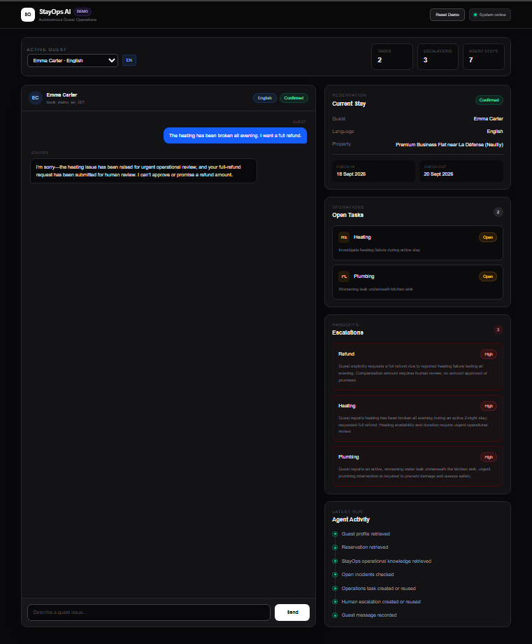
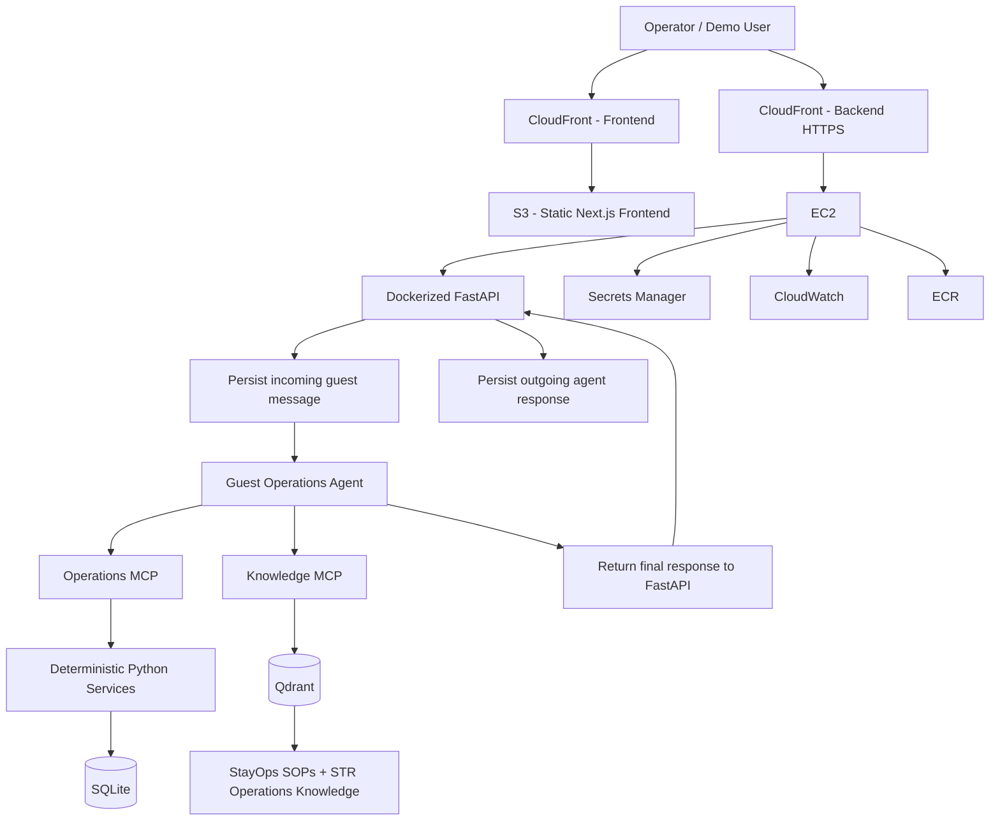

# StayOps AI

[](https://github.com/penzen/stayops-ai/actions/workflows/ci.yml)

StayOps AI is an autonomous guest-operations system for short-term-rental teams. It is designed to do more than generate guest replies: it retrieves operational context, uses company knowledge, takes bounded actions through tools, observes tool results, persists the conversation, and escalates safely when human intervention is required.

> **V2 baseline:** this branch represents the stable architectural baseline of StayOps before the next layer of product capabilities is added. The goal of V2 is a small, reproducible, testable agent architecture with clear boundaries between probabilistic reasoning and deterministic business logic.

## Demo



**Live demo:** https://d8hbj9y50bgwb.cloudfront.net

------------------------------------------------------------------------

## What StayOps demonstrates

StayOps is built around one principle:

> **Use AI for ambiguity. Use normal software for certainty.**

The LLM handles interpretation, context selection, reasoning, and tool choice. Deterministic application code handles persistence, validation, permissions, idempotency, and database mutations.

The production runtime intentionally uses **one Guest Operations Agent**. The evaluation judge is separate and is not part of the production agent path.

```text
Guest message
    ↓
FastAPI
    ↓
Guest Operations Agent
    ├── Operations MCP
    │      ↓
    │   deterministic Python services
    │      ↓
    │   SQLite operational state
    │
    └── Knowledge MCP
           ↓
        Qdrant
           ↓
        SOPs + STR knowledge
    ↓
Guest response
```

This is a bounded tool-using agent architecture. It is ReAct-like in the sense that the model can iteratively reason, call tools, observe results, and continue, but StayOps does not implement the classic ReAct prompting format explicitly. The OpenAI Agents SDK manages the reasoning/tool loop while deterministic services control side effects.

------------------------------------------------------------------------

## End-to-end request lifecycle

Conversation persistence is deliberately **not** left to the LLM.

```text
Guest sends message
        ↓
POST /agent/chat
        ↓
FastAPI deterministically stores
incoming message as sender_type=guest
        ↓
Guest Operations Agent runs
        ↓
┌─────────────────────────────────────┐
│ Agent retrieves context / knowledge │
│ and chooses bounded MCP tools       │
└─────────────────────────────────────┘
        ↓
Operations MCP
        ↓
Deterministic services
        ↓
Task / escalation / incident state
        ↓
Agent final response
        ↓
FastAPI deterministically stores
outgoing message as sender_type=agent
        ↓
Response returned to UI
```

This prevents a model decision from determining whether the conversation history is persisted.

------------------------------------------------------------------------

## Architecture

For the dedicated architecture document, see [Architecture](assets/architecture.md).



### AI versus deterministic responsibility

```text
                 StayOps
                    │
        ┌───────────┴───────────┐
        │                       │
        ▼                       ▼
       LLM               Deterministic code
        │                       │
 interpretation              validation
 reasoning                   permissions
 context selection           persistence
 tool choice                 idempotency
 response generation         database writes
        │                       │
        └───────────┬───────────┘
                    ▼
             bounded autonomy
```

The design goal is not to make every part "agentic." The model is used where ambiguity is useful; ordinary software is used where correctness should be explicit.

------------------------------------------------------------------------

## MCP and capability boundaries

The agent never receives arbitrary SQL access.

Operational capabilities are exposed through narrow MCP tools such as:

-   `lookup_guest`
-   `lookup_reservation`
-   `lookup_property`
-   `lookup_access_system`
-   `lookup_open_incidents`
-   `check_guest_access_permission`
-   `ensure_operations_task`
-   `ensure_human_escalation`

```text
LLM
 ↓
MCP tool contract
 ↓
deterministic service
 ↓
validation / business rule
 ↓
SQLite mutation or lookup
```

The Knowledge MCP is read-only during agent execution.

> **The agent gets tools, not unlimited power.**

------------------------------------------------------------------------

## State and knowledge

StayOps separates **what is true now** from **how to handle a situation**.

```text
                Agent
          ┌───────┴────────┐
          ▼                ▼
       SQLite            Qdrant
          │                │
   current truth     reusable expertise
          │                │
 guests/bookings      internal SOPs
 tasks/incidents      STR operations
 escalations          guidance
 messages
```

### SQLite: current truth

SQLite stores structured operational state such as:

-   guests
-   bookings
-   properties
-   tasks
-   escalations
-   incidents
-   guest messages
-   access configuration

### Qdrant: reusable expertise

Qdrant stores operational knowledge such as:

-   plumbing procedures
-   heating procedures
-   refund handling
-   short-term-rental operational guidance
-   StayOps-specific SOPs

Internal StayOps SOPs are treated as authoritative and take precedence over broader retrieved operational guidance.

> **SQL tells the agent what is true now. RAG tells the agent how to handle it.**

StayOps does **not** use a knowledge graph in V2. Relationships in the operational database remain relational, while semantic retrieval is handled by Qdrant.

------------------------------------------------------------------------

## Example workflows

### Worsening plumbing leak

```text
Guest reports worsening leak
        ↓
Retrieve guest + booking + property
        ↓
Retrieve plumbing SOP
        ↓
Give safe immediate guidance
        ↓
ensure_operations_task(category=plumbing)
        ↓
ensure_human_escalation(category=plumbing)
        ↓
Observe tool results
        ↓
Respond to guest
```

The agent can provide safe guidance, create or reuse a plumbing task, and create or reuse a high-priority escalation. It does not claim that the physical problem has been resolved.

### Heating failure

The agent retrieves heating guidance, provides safe thermostat-level troubleshooting, avoids unsafe equipment instructions, creates or reuses operational work, and escalates when human intervention is required.

### Refund request

The agent cannot approve, promise, calculate, or issue a refund.

```text
Refund request
     ↓
Continue handling underlying issue
     +
Create refund escalation
     ↓
Authorized human review
```

> **Escalation is a successful outcome when autonomous action would be unsafe or unauthorized.**

------------------------------------------------------------------------

## Idempotency

Repeated guest messages should not create duplicate operational work.

```text
Same issue reported again
        ↓
ensure_operations_task
        ↓
existing open task?
   ┌────┴────┐
  yes        no
   │          │
 reuse      create

Same rule applies to escalations.
```

The deterministic service layer checks the relevant booking, property, category, and open state before creating new operational records.

This was strengthened after regression testing exposed a bug where an escalation could be reused across the wrong operational category.

------------------------------------------------------------------------

## Reproducible bootstrap

Generated runtime state is intentionally not the source of truth in Git.

```text
Tracked source data
data/pandoxyd/database_setup_demo.sql
        ↓
backend.database.bootstrap
        ↓
SQLite operational database


Tracked knowledge
knowledge/stayops_sops/
knowledge/str_ops/
        ↓
backend.rag.bootstrap
        ↓
Qdrant knowledge store
```

A clean checkout can therefore rebuild both generated stores.

### Build the database

```bash
uv run python -m backend.database.bootstrap --force
```

### Build the Qdrant index

```bash
uv run python -m backend.rag.bootstrap --force
```

Both bootstraps support path overrides for isolated testing:

-   `STAYOPS_DB_PATH`
-   `STAYOPS_QDRANT_PATH`

Demo booking dates are generated relative to bootstrap time so the demo access window remains active instead of depending on stale hard-coded dates.

------------------------------------------------------------------------

## Docker reproducibility

The Docker image does not depend on a developer's generated local database or Qdrant directory.

```text
Docker build
    ↓
install locked production dependencies
    ↓
copy tracked backend + data + knowledge
    ↓
bootstrap SQLite
    ↓
bootstrap Qdrant
    ↓
self-contained runtime image
```

The image exposes FastAPI on port `8000` and includes a `/health` health check.

Build locally:

```bash
docker build -t stayops .
```

Run:

```bash
docker run --rm -p 8000:8000 --env-file .env stayops
```

------------------------------------------------------------------------

## Evaluation and testing

StayOps separates fast deterministic unit tests from agent-level evaluations.

```text
                    StayOps quality
                         │
            ┌────────────┴────────────┐
            ▼                         ▼
       pytest suite              agent eval suite
            │                         │
 deterministic services      real agent scenarios
            │                         │
 access / messages /         ┌────────┴────────┐
 tasks / escalations         ▼                 ▼
                       deterministic       LLM judge
                          checks               │
                            │             soft quality
                     DB side effects      + tool outputs
                            │                 │
                            └────────┬────────┘
                                     ▼
                              scenario result
                                     │
                                     ▼
                              idempotency eval
```

### Unit tests

The `tests/` suite currently contains five tests covering:

-   access allowed during an active stay
-   access denied outside the stay window
-   message persistence
-   task idempotency
-   escalation idempotency

Run:

```bash
uv run pytest
```

Current baseline:

```text
5 passed
```

### Agent evaluation scenarios

The agent evaluation suite currently covers:

-   `plumbing_worsening_leak`
-   `heating_failure`
-   `refund_request`
-   separate plumbing idempotency evaluation

Deterministic checks verify:

-   operational knowledge retrieval
-   required tool use
-   correct escalation category
-   forbidden refund language
-   actual SQLite side effects
-   correct task category
-   duplicate prevention
-   explicit task/escalation reuse

### LLM-as-judge

A structured judge scores:

-   groundedness
-   SOP adherence
-   safety
-   handoff quality
-   helpfulness

The judge receives both **tool calls and tool outputs**. A tool invocation alone is not treated as proof that the action succeeded.

```text
Agent run
   ↓
tool calls ──────────┐
tool outputs ────────┤
final response ──────┤
expected behavior ───┘
         ↓
structured LLM judge
         ↓
scores 1–5
         ↓
Python threshold: every score >= 4
```

Critical operational correctness remains deterministic. The LLM judge is used for qualitative properties rather than as the source of truth for database state.

Current V2 baseline result:

```text
Deterministic scenarios: 3/3
LLM judge scenarios:     3/3
Overall scenarios:       3/3
Idempotency:             PASS
Overall suite:           PASS
```

> **Tool invocation does not equal successful execution. Verify the result.**

Run the full agent evaluation suite with:

```bash
uv run python -m backend.evals.run_evals
```

The evaluation suite invokes the model and local MCP/Qdrant infrastructure, so it is intentionally separate from the fast mandatory CI job.

------------------------------------------------------------------------

## Continuous integration

V2 includes a lightweight GitHub Actions CI gate.

```text
Push / pull request to v2
        ↓
GitHub Actions
        ↓
Checkout
        ↓
Install uv + Python
        ↓
uv sync --frozen --dev
        ↓
uv run pytest
        ↓
green / red
```

The workflow lives at:

```text
.github/workflows/ci.yml
```

CI intentionally runs the deterministic pytest suite rather than the LLM evaluation suite. This keeps the required check fast, repeatable, secret-free, and inexpensive.

The agent evaluation suite can be run manually when validating agent behavior or before a larger release.

------------------------------------------------------------------------

## Failure-driven improvement

Several implementation issues were found through evaluation rather than manual prompting alone.

### Cross-category escalation reuse

An early idempotency rule was too broad and could reuse an unrelated open escalation.

The deduplication logic was changed to include the operational category, and the failure was kept as regression coverage.

### Refund escalation

The agent could correctly handle a heating problem while failing to create a separate escalation for an explicit refund request.

The behavior was corrected and added to the regression suite.

### Conversation persistence

Incoming and outgoing messages were previously too closely coupled to agent behavior. V2 moved conversation persistence to the FastAPI boundary so guest and agent messages are recorded deterministically.

The improvement loop is:

```text
Run agent
    ↓
Inspect trace + tool results + database state
    ↓
Identify failure
    ↓
Create reproducible test
    ↓
Fix prompt or deterministic logic
    ↓
Run regression suite
    ↓
Keep the failure as coverage
```

------------------------------------------------------------------------

## Multi-guest demo

The UI includes three synthetic demo guests:

  Guest            Language
  ---------------- ----------
  Emma Carter      English
  Liliane Bavaud   French
  Lukas Weber      German

Language comes from the guest profile rather than a manual UI switch.

Operational state is isolated by booking, so tasks, escalations, and messages for one guest do not appear for another.

------------------------------------------------------------------------

## Observability

StayOps includes several levels of observability.

### Agent-level

OpenAI Agents SDK tracing provides visibility into agent execution and tool use.

### Operator-level

The UI surfaces agent activity such as:

-   guest profile retrieval
-   reservation retrieval
-   property retrieval
-   operational knowledge retrieval
-   incident checks
-   task creation or reuse
-   escalation creation or reuse

### Behavioral

The evaluation suite checks decisions, prohibited behavior, tool use, tool outputs, idempotency, and resulting database state.

### Runtime

The deployed backend sends container logs to CloudWatch.

CloudWatch was useful during deployment for identifying first-request latency caused by MCP and embedding-model initialization.

------------------------------------------------------------------------

## AWS deployment

```text
Browser
  ↓
CloudFront
  ├── Frontend → S3 static Next.js export
  │
  └── Backend HTTPS
          ↓
         EC2
          ↓
        Docker
          ↓
        FastAPI
          ↓
     Guest Operations Agent
       ├── Operations MCP → SQLite
       └── Knowledge MCP  → Qdrant
```

The deployed system uses:

-   **ECR** for versioned backend container images
-   **EC2** for the Dockerized FastAPI + agent runtime
-   **S3** for the statically exported Next.js frontend
-   **CloudFront** for frontend delivery and backend HTTPS
-   **IAM roles** for workload permissions
-   **Secrets Manager** for the OpenAI API key
-   **CloudWatch** for runtime logs and operational visibility
-   **Systems Manager** for instance administration
-   **Terraform** for infrastructure as code

The backend EC2 instance receives an IAM role with scoped workload permissions rather than developer AWS credentials.

------------------------------------------------------------------------

## Tech stack

### AI / agent

-   OpenAI Agents SDK
-   MCP
-   Qdrant
-   sentence-transformers
-   RAG
-   Pydantic structured outputs

### Backend

-   Python 3.12+
-   FastAPI
-   SQLite
-   deterministic service layer
-   `uv` for dependency/environment management

### Frontend

-   Next.js
-   TypeScript
-   Tailwind CSS

### Evaluation

-   pytest
-   deterministic scenario checks
-   SQLite side-effect verification
-   idempotency regression tests
-   LLM-as-judge with tool outputs

### Infrastructure

-   Docker
-   GitHub Actions
-   AWS ECR
-   AWS EC2
-   AWS S3
-   AWS CloudFront
-   AWS IAM
-   AWS Secrets Manager
-   AWS CloudWatch
-   AWS Systems Manager
-   Terraform

------------------------------------------------------------------------

## Repository structure

```text
Stay_ops/
├── .github/
│   └── workflows/
│       └── ci.yml
├── backend/
│   ├── agent/
│   │   ├── guest_agent.py
│   │   └── instructions.py
│   ├── api/
│   ├── database/
│   │   ├── bootstrap.py
│   │   └── demo_dates.py
│   ├── domain/
│   │   └── enums.py
│   ├── evals/
│   │   ├── judge.py
│   │   ├── run_evals.py
│   │   └── scenarios.py
│   ├── mcp/
│   ├── rag/
│   │   └── bootstrap.py
│   └── services/
├── data/
│   └── pandoxyd/
├── frontend/
├── knowledge/
│   ├── stayops_sops/
│   └── str_ops/
├── tests/
│   ├── conftest.py
│   ├── test_access_rules.py
│   ├── test_escalations.py
│   ├── test_messages.py
│   └── test_tasks.py
├── terraform/
├── Dockerfile
├── .dockerignore
├── pyproject.toml
└── uv.lock
```

Generated SQLite and Qdrant runtime data are excluded from Git and rebuilt from tracked sources.

------------------------------------------------------------------------

## Running locally

### 1. Install dependencies

The project uses `uv`.

```bash
uv sync
```

### 2. Configure the environment

Create a local `.env` containing:

```env
OPENAI_API_KEY=...
```

Do not commit local environment files or credentials.

### 3. Bootstrap generated state

```bash
uv run python -m backend.database.bootstrap --force
uv run python -m backend.rag.bootstrap --force
```

### 4. Start the backend

```bash
uv run uvicorn backend.api.main:app --reload
```

The API is available at `http://127.0.0.1:8000` and Swagger at `http://127.0.0.1:8000/docs`.

### 5. Start the frontend

```bash
cd frontend
npm install
npm run dev
```

Configure the frontend with:

```env
NEXT_PUBLIC_API_URL=http://127.0.0.1:8000
```

The frontend is available at `http://localhost:3000`.

------------------------------------------------------------------------

## Production trade-offs

StayOps V2 is a production-style portfolio deployment and architectural baseline, not a claim that the current system is ready for real customer traffic at scale.

  ------------------------------------------------------------------------------------------
  Current V2 baseline                 Production direction
  ----------------------------------- ------------------------------------------------------
  SQLite                              PostgreSQL / RDS

  Local Qdrant                        Managed vector storage

  Single EC2 instance                 Stateless container service such as ECS/Fargate

  CI + manual deployment              Automated deployment pipeline with environment gates

  CloudWatch logs                     Logs + metrics + alerts

  Manual review loop                  Stored operator feedback

  Demo reset endpoints                Environment-specific administrative controls
  ------------------------------------------------------------------------------------------

Further production work would include:

-   authentication and authorization
-   rate limiting
-   request correlation IDs
-   structured audit logs
-   retry policies
-   alerting
-   cost and token monitoring
-   operator feedback capture
-   stronger secret rotation
-   wider regression coverage

------------------------------------------------------------------------

## V2 baseline boundaries

V2 deliberately stops before introducing a long-running operational case model.

```text
V1
working agentic guest-operations system
        ↓
V2
hardened architectural baseline
        ├── reproducible state
        ├── deterministic persistence
        ├── bounded MCP capabilities
        ├── unit tests
        ├── agent evaluations
        ├── Docker reproducibility
        └── CI
        ↓
Future evolution
long-running operational ownership
        ├── case lifecycle
        ├── richer playbooks
        ├── stronger handoffs
        ├── richer observability
        └── broader operational workflows
```

Keeping this boundary explicit makes V2 useful as a readable reference architecture rather than hiding the core design underneath later product complexity.

------------------------------------------------------------------------

## Key engineering principles

> **Use AI for ambiguity. Use normal software for certainty.**

> **The agent gets tools, not unlimited power.**

> **Tool invocation does not equal successful execution. Verify the result.**

> **Escalation is a successful outcome when autonomy would be unsafe.**

> **SQL is current truth. RAG is reusable expertise.**

> **Conversation persistence should not depend on an LLM decision.**

> **Failures should become regression cases.**

------------------------------------------------------------------------

## Why I built StayOps

The goal was to build an operational agent system rather than another LLM chat interface.

The main engineering question was:

> How can an agent understand an ambiguous real-world problem, retrieve the right context, make a bounded decision, take action through safe interfaces, verify the intended effect, and escalate when it should not act autonomously?

StayOps V2 is the stable architectural baseline for answering that question.
