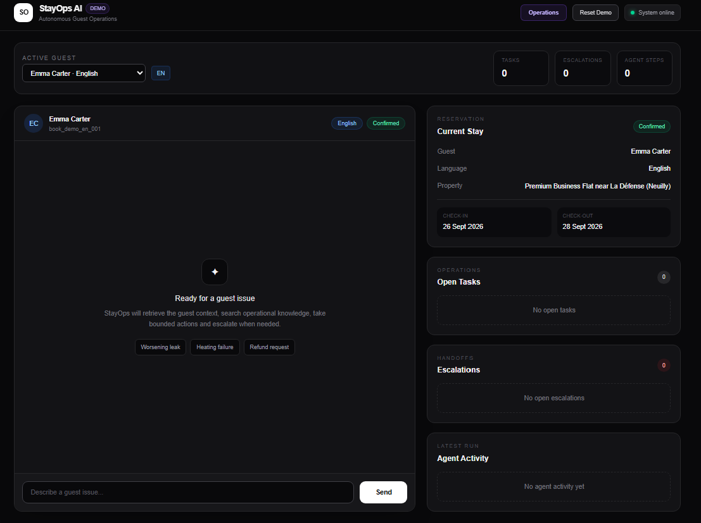
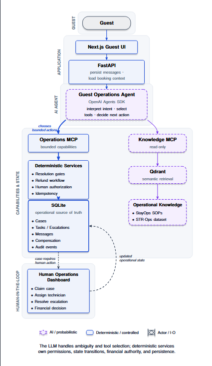

# StayOps AI

[](https://github.com/penzen/stayops-ai/actions/workflows/ci.yml)

**StayOps is a bounded AI guest-operations system for short-term-rental teams.**

It combines an LLM agent with deterministic operational workflows, retrieval-augmented knowledge, persistent Case state, human handoffs, financial review, audit trails, and an operations dashboard.

> **Use AI for ambiguity. Use normal software for certainty.**

The model handles messy guest language, intent, context, and tool selection. Deterministic services own permissions, persistence, state transitions, idempotency, financial authority, and resolution gates.

## Live demo

**https://d8hbj9y50bgwb.cloudfront.net**



The V5 demo supports:

- isolated public demo sessions with no account required
- sample stays and custom fictional guest/reservation creation
- guest messaging through the AI operations agent
- Overview dashboard with active operational state
- Guest directory and guest detail views
- global search across guests, reservations, and Cases
- human Operations queue and Case ownership
- technician assignment and task completion
- compensation review with human approval/denial
- deep links between Guest Ops, Guests, Search, and Operations
- session-scoped data isolation between demo users

---

## Why StayOps exists

A useful operations agent has to do more than generate a good response.

It needs to determine:

- which guest, booking, and property a message belongs to
- whether a message is a new issue or a follow-up
- which operational procedure applies
- whether the agent is allowed to act
- whether a technician or human operator is required
- whether a requested action actually happened
- whether enough evidence exists to close a Case
- whether a financial request is linked to the operational incident that caused it

StayOps treats those as **system-design problems**, not just prompting problems.

---

## Architecture

<p align="center">
  
</p>

```text
Guest / Operator UI
        |
        v
     Next.js
        |
        v
     FastAPI
        |
        v
Guest Operations Agent
   |               |
   |               |
   v               v
Operations MCP   Knowledge MCP
   |               |
   v               v
Deterministic     Qdrant
services          SOP / STR knowledge
   |
   v
SQLite
   |
   +--> Cases
   +--> tasks
   +--> escalations
   +--> messages
   +--> compensation
   +--> audit events
```

The production path intentionally uses **one Guest Operations Agent**. StayOps does not split work into multiple agents simply because the system is agentic. Separate deterministic services and explicit human workflows are used where they provide stronger guarantees.

For the longer architecture document, see [`assets/architecture.md`](assets/architecture.md).

---

## Bounded autonomy

The central design boundary is:

| LLM owns | Deterministic code owns |
|---|---|
| intent interpretation | validation |
| issue classification | permissions |
| ambiguity handling | persistence |
| context-aware tool choice | Case lifecycle |
| guest communication | idempotency |
| new-vs-follow-up reasoning | financial authority |
| deciding when human help is needed | resolution gates |

The LLM never receives arbitrary database access. It receives bounded MCP tools that call deterministic services.

```text
LLM
 |
 v
MCP tool
 |
 v
deterministic service
 |
 v
validation / permission check
 |
 v
SQLite
```

> **The agent gets tools, not unlimited power.**

---

## Agent runtime optimization

StayOps was optimized from measurements rather than intuition.

The original benchmark showed that the agent was spending substantial time starting MCP subprocesses and repeatedly retrieving deterministic context that the application already knew.

### Final benchmark

| Metric | Original baseline | Final optimized | Change |
|---|---:|---:|---:|
| Average latency | 22.48s | 10.65s | **52.6% lower** |
| Average LLM calls | 5.22 | 3.93 | **24.7% fewer** |
| Average tool calls | 8.56 | 5.60 | **34.6% fewer** |
| Average input tokens | ~45.4k | ~28.1k | **38.1% fewer** |
| Deterministic scenario pass rate | 100% | 100% | preserved |
| Estimated text-token cost | not measured | **~$0.00286 / interaction** | measured |
| Agent model | SDK default | `gpt-5.6-luna` | explicitly pinned |

The final benchmark used five runs per scenario across plumbing, heating, and refund workflows.

### What changed

**1. Persistent MCP lifecycle**

Originally the Operations MCP and Knowledge MCP were started for every guest message. They now start once with the FastAPI application lifecycle and are reused across requests.

This alone reduced average latency from **22.48s to ~12.77s** in the first persistent-MCP benchmark.

**2. Deterministic context prefetch**

Python now loads context the backend already knows before the agent runs:

- guest
- reservation
- property
- open Cases
- recent Case history
- recent booking conversation

This removed redundant lookup tool calls while keeping meaningful operational actions agent-driven.

**3. Prompt-cache measurement before optimization**

The baseline already showed roughly **75–81% prompt-cache hit rates**, so prompt caching was not the main bottleneck.

StayOps deliberately avoids caching complete state-dependent responses because Case, task, escalation, reservation, or compensation state may change between turns.

**4. Reproducible model + cost instrumentation**

The agent is pinned to:

```text
gpt-5.6-luna
reasoning effort: none
verbosity: low
```

The benchmark records latency, model requests, tool calls, token usage, cache usage, estimated token cost, and tool-call distribution.

The full optimization methodology and benchmark details are in [`STAYOPS_OPTIMIZATION_REPORT.md`](STAYOPS_OPTIMIZATION_REPORT.md).

> **The goal was not simply a faster agent. It was less unnecessary agent work without weakening correctness.**

---

## Case-centric operational state

Operational work belongs to persistent **Cases** rather than to individual chat turns.

```text
Guest
  |
  v
Booking
  |
  +--> Heating Case
  +--> Plumbing Case
  +--> Access Case
  +--> Refund Case
```

A Case tracks its category, workflow state, summary, owner, related tasks, escalations, compensation evidence, and audit history.

Typical workflow states are:

```text
open
  |
  v
in_progress
  |
  +--> waiting_guest
  |
  +--> waiting_human
  |
  v
resolved
```

The state describes **what must happen next**, not merely which database records exist.

### Evidence-gated resolution

The agent cannot mark a Case resolved just because a reply sounds complete.

Resolution checks deterministic evidence such as:

- required resolution evidence
- open tasks
- open escalations
- relevant workflow-specific conditions

A completed task or resolved escalation is not automatically proof that the guest's underlying issue is resolved.

---

## Human handoff is part of the architecture

Escalation is a valid outcome, not an agent failure.

```text
Agent
  |
  v
human action required
  |
  v
create/reuse escalation
  |
  v
Case -> waiting_human
  |
  v
Operations queue
  |
  v
operator claims Case
  |
  v
bounded human actions
```

The Operations UI supports:

- Case queue and priority
- guest, booking, and property context
- Case ownership
- conversation history
- technician assignment
- task completion
- escalation resolution
- financial review
- compensation evidence
- Case timeline
- return-to-agent workflow

Human actions are authorization-aware: claiming a Case establishes the operator allowed to perform protected actions on it.

---

## Refund and compensation safety

Financial authority stays outside the LLM.

The agent cannot:

- approve or deny compensation
- invent a refund amount or percentage
- promise payment
- claim that a refund was approved without a recorded human decision

A refund request creates or reuses a dedicated Refund Case:

```text
Guest requests refund
        |
        v
ensure_refund_workflow
        |
        v
Refund Case
        |
        +--> Compensation Request
        |
        +--> Financial escalation
        |
        v
waiting_human
        |
        v
Authorized human decision
```

Operational and financial Cases remain separate but can be linked through `related_case_id`, preserving the incident evidence behind a compensation request.

This relationship remains available even after the operational Case has been resolved.

---

## SQL vs RAG

StayOps separates two different questions:

> **What is true now?**

from:

> **How should this situation be handled?**

```text
                 Agent
              /         \
             v           v
          SQLite       Qdrant
             |           |
       current truth    expertise
             |           |
           guests        SOPs
           bookings      procedures
           Cases         STR knowledge
           tasks
           escalations
           decisions
```

SQLite is operational truth. Qdrant provides reusable operational knowledge.

Internal StayOps SOPs take precedence over broader retrieved guidance.

> **SQL tells the agent what is true. RAG tells the agent how to handle it.**

---

## Idempotency and multi-turn behavior

Repeated guest messages should not multiply operational records.

Deterministic reuse logic covers:

- Cases
- tasks
- escalations
- compensation requests
- refund workflows

```text
same unresolved issue
        |
        v
matching active record?
      /        \
    yes         no
     |           |
   reuse       create
```

The agent also receives bounded recent Case and conversation context, allowing messages such as:

> "It is still broken."

to be interpreted as follow-ups rather than automatically creating new operational work.

If several Cases are plausible, the system asks for clarification instead of guessing.

---

## Evaluation-driven development

StayOps does not treat:

```text
tool called
```

as equivalent to:

```text
operation succeeded
```

The evaluation path checks the actual result:

```text
scenario
   |
   v
tool calls
   |
   v
tool outputs
   |
   v
database state
   |
   v
final response
   |
   +--> deterministic assertions
   |
   +--> LLM judge
```

This exposed real implementation failures during development, including:

- tool calls that did not produce the expected database mutation
- duplicate operational work
- cross-category escalation reuse
- refund paths that could bypass the canonical financial workflow
- ambiguous operational-to-refund Case linking
- human actions without sufficient ownership checks

Those failures became regression tests.

At the V5 release gate:

- **140 backend tests passed**
- frontend lint/build passed
- deterministic agent scenarios passed
- LLM-judge scenarios passed
- idempotency, multi-turn reuse, handoff, financial authority, approval, denial, and historical refund evaluations passed

Run locally:

```bash
uv run pytest
uv run python -m backend.evals.run_evals
```

Performance benchmark:

```bash
uv run python -m backend.evals.run_performance_baseline
```

---

## Demo session isolation

The public demo does not require account creation, but different users must not share operational state.

StayOps uses server-issued demo sessions with:

- hashed session tokens
- six-hour expiry
- session-owned sample/custom stays
- authorization checks before agent execution
- session-scoped Overview, Guests, Search, and Operations data
- session ownership checks for Cases, tasks, escalations, incidents, and compensation

Opening a separate browser/incognito session produces an isolated demo environment.

---

## AWS deployment

```text
Browser
   |
   v
CloudFront
   |
   +--> S3
   |    Next.js static frontend
   |
   +--> EC2
        Docker
          |
          v
        FastAPI
          |
          v
        Guest Operations Agent
          |
          +--> Operations MCP -> SQLite
          |
          +--> Knowledge MCP  -> Qdrant
```

Infrastructure includes:

- Amazon ECR
- Amazon EC2
- Amazon S3
- Amazon CloudFront
- AWS IAM
- AWS Secrets Manager
- Amazon CloudWatch
- AWS Systems Manager
- Terraform

The runtime uses an IAM role rather than embedded developer credentials.

Backend releases use immutable ECR image tags. V5 is deployed from:

```text
stayops-backend:v5-1b1c65c
```

Application releases update the existing EC2 runtime in place through AWS Systems Manager, preserving the SQLite volume mounted at:

```text
/opt/stayops/database/stayops.db
```

Terraform owns the surrounding infrastructure while ignoring AMI/user-data drift that would otherwise replace the stateful demo instance during routine application releases.

---

## Tech stack

| Layer | Technology |
|---|---|
| Agent | OpenAI Agents SDK |
| Agent tools | Model Context Protocol |
| Model | `gpt-5.6-luna` |
| API | FastAPI |
| Operational state | SQLite |
| Retrieval | Qdrant + sentence-transformers |
| Frontend | Next.js, React, TypeScript, Tailwind CSS |
| Validation | Pydantic |
| Testing | pytest + agent scenario evals + LLM judge |
| Packaging | Docker + `uv` |
| CI | GitHub Actions |
| Infrastructure | Terraform + AWS |

---

## Repository structure

```text
stayops-ai/
├── backend/
│   ├── agent/          # agent configuration + instructions
│   ├── api/            # FastAPI routes and application lifecycle
│   ├── database/       # reproducible SQLite bootstrap
│   ├── domain/         # enums and structured playbooks
│   ├── evals/          # correctness + performance evaluation
│   ├── mcp/            # bounded operational MCP server
│   ├── observability/  # model/token/cost metrics
│   ├── rag/            # Qdrant bootstrap
│   └── services/       # deterministic business logic
├── frontend/
│   └── src/app/
│       ├── dashboard/
│       ├── guest-ops/
│       ├── guests/
│       ├── operations/
│       └── search/
├── knowledge/
├── tests/
├── terraform/
├── assets/
├── STAYOPS_OPTIMIZATION_REPORT.md
├── Dockerfile
├── pyproject.toml
└── uv.lock
```

---

## Run locally

### Backend

```bash
git clone https://github.com/penzen/stayops-ai.git
cd stayops-ai

uv sync

# .env
# OPENAI_API_KEY=your_key_here

uv run python -m backend.database.bootstrap --force
uv run python -m backend.rag.bootstrap --force

uv run uvicorn backend.api.main:app --reload --host 127.0.0.1 --port 8000
```

Backend:

```text
http://127.0.0.1:8000
```

API docs:

```text
http://127.0.0.1:8000/docs
```

### Frontend

```bash
cd frontend
npm install
```

Create the frontend environment:

```env
NEXT_PUBLIC_API_URL=http://127.0.0.1:8000
```

Run:

```bash
npm run dev
```

Frontend:

```text
http://localhost:3000
```

---

## Continuous integration

GitHub Actions validates both backend and frontend on pushes and pull requests to `main` and `v5`.

Backend CI:

```text
Python 3.12
  -> uv sync --frozen --dev
  -> uv run pytest
```

Frontend CI:

```text
Node.js 22
  -> npm ci
  -> npm run lint
  -> npm run build
```

Model-based evaluations remain separate because they require model credentials and external model calls.

---

## Current boundaries

StayOps is a production-oriented portfolio system, not a finished multi-tenant hospitality SaaS.

| Current implementation | Likely production evolution |
|---|---|
| SQLite | PostgreSQL / RDS |
| Local Qdrant | managed vector infrastructure |
| Single EC2 runtime | stateless multi-instance runtime |
| Demo session isolation | full authentication + organization RBAC |
| CloudWatch runtime logs | metrics, alerting, trace correlation |
| Human dashboard workflow | notification integrations + richer routing |
| Manual app deployment | staged CI/CD deployment |

Useful future work includes rate limiting, stronger authentication/RBAC, structured request correlation, managed database/vector infrastructure, streaming responses, alerting, and multi-instance concurrency controls.

---

## Design principles

> **Use AI for ambiguity. Use normal software for certainty.**

> **The agent gets tools, not unlimited power.**

> **Human handoff is part of the architecture, not an exception.**

> **Tool invocation does not equal successful execution. Verify resulting state.**

> **SQL is operational truth. RAG is reusable expertise.**

> **Financial decisions belong to humans.**

> **Resolution requires evidence.**

> **Failures should become regression tests.**

---

## Why I built StayOps

I wanted to build something closer to an actual AI operations product than a chatbot demo.

The core engineering question was:

> **How can an LLM handle ambiguous real-world requests while remaining constrained by deterministic permissions, persistent operational state, evidence-based workflow rules, and human authority?**

StayOps explores that across the full lifecycle:

```text
understand
   |
   v
retrieve context
   |
   v
choose bounded tools
   |
   v
persist operational state
   |
   v
coordinate human work
   |
   v
verify effects
   |
   v
retain evidence
   |
   v
resolve only when justified
```

The goal is not maximum autonomy.

The goal is **useful autonomy with explicit boundaries**.
