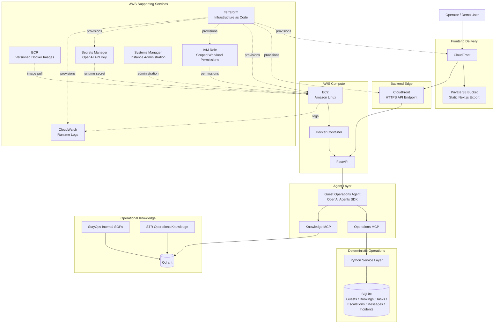

# StayOps AI — Architecture



## Request flow

```text
Guest message
    ↓
CloudFront frontend
    ↓
CloudFront backend HTTPS
    ↓
FastAPI
    ↓
Guest Operations Agent
    ├── structured operational context via Operations MCP
    ├── reusable expertise via Knowledge MCP + Qdrant
    ↓
bounded tool action
    ↓
deterministic service layer
    ↓
SQLite state change
    ↓
agent verifies / responds
    ↓
UI updates tasks, escalations and agent activity
```

## Key architectural boundaries

- **LLM for ambiguity:** interpretation, reasoning, context selection, tool choice.
- **Deterministic code for certainty:** permissions, validation, state mutation, idempotency, database operations.
- **SQL for current truth:** live booking and operational state.
- **RAG for reusable expertise:** SOPs and short-term-rental operational knowledge.
- **MCP as the capability boundary:** the model gets explicit tools rather than direct database access.
- **Human handoff as a valid outcome:** the agent escalates when an action is unsafe or unauthorized.
