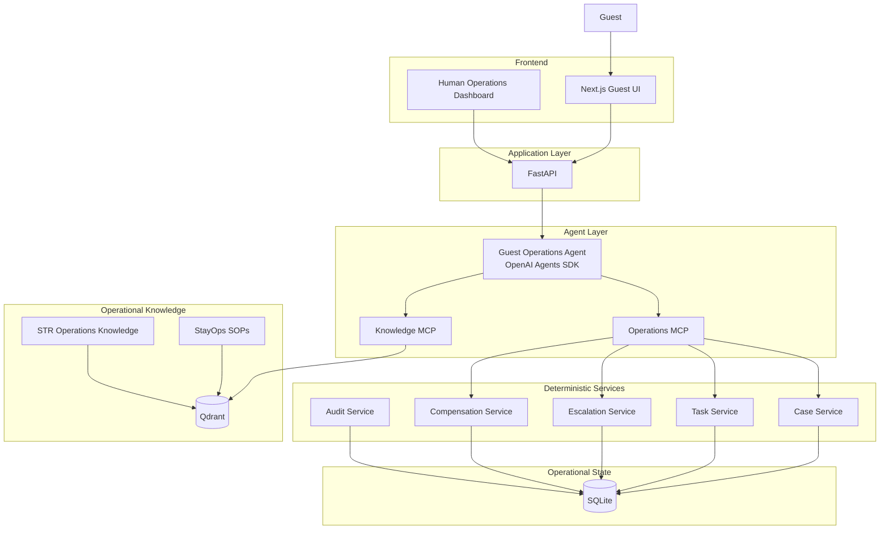
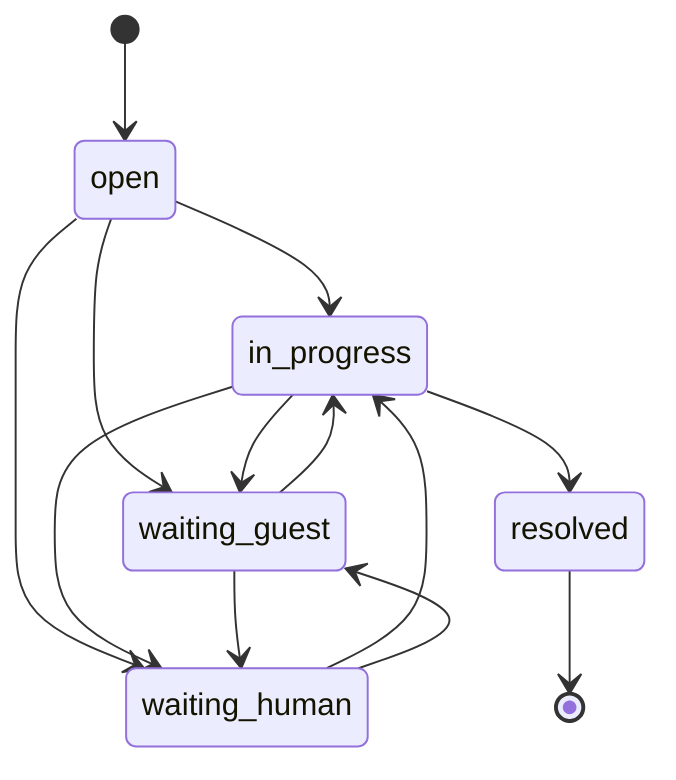
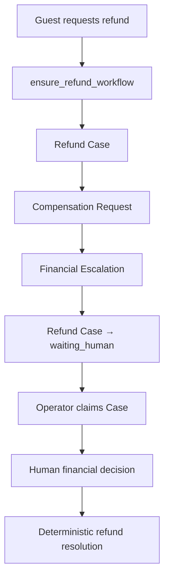
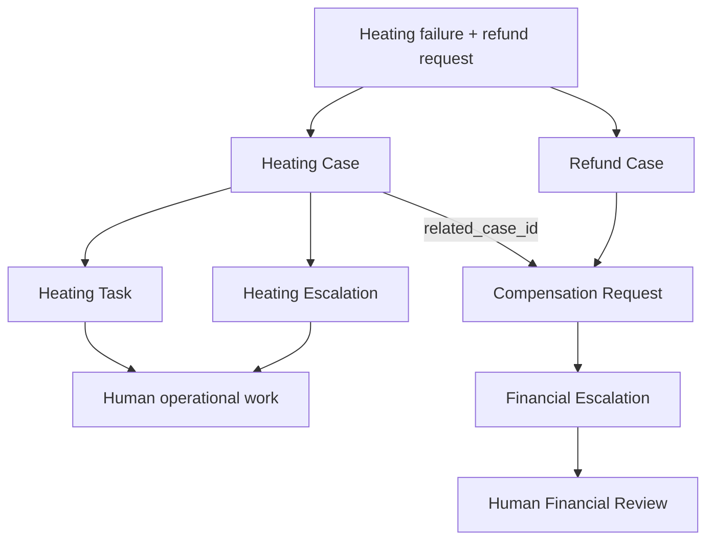
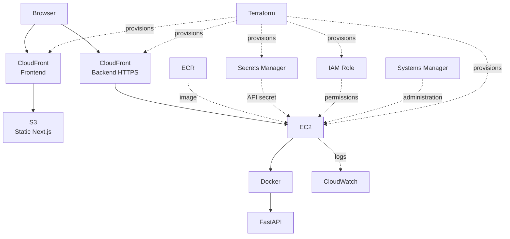

# StayOps AI — Architecture

StayOps is a bounded AI operations system for short-term-rental guest support.

The architecture deliberately separates:

- probabilistic reasoning
- deterministic business logic
- current operational state
- reusable operational knowledge
- human authority

The core principle is:

> **Use AI for ambiguity. Use normal software for certainty.**

---

# High-level architecture



---

# Responsibility boundary

StayOps does not let the LLM directly control the operational database.

```text
                   StayOps
                      │
          ┌───────────┴───────────┐
          │                       │
          ▼                       ▼
         LLM               Deterministic code
          │                       │
 interpretation              validation
 reasoning                   permissions
 intent detection            persistence
 issue classification        Case state
 tool selection              idempotency
 context selection           database writes
 communication               financial authority
          │                  resolution gates
          │                       │
          └───────────┬───────────┘
                      ▼
               bounded autonomy
```

The model is responsible for ambiguity.

Application code is responsible for authority.

---

# Request lifecycle

Guest messages are persisted outside the model.

```text
Guest sends message
        ↓
FastAPI
        ↓
Persist guest message
        ↓
Load booking context
        ↓
Load active / recent Cases
        ↓
Guest Operations Agent
        ↓
Agent selects bounded tools
        ↓
Operations MCP / Knowledge MCP
        ↓
Deterministic services
        ↓
SQLite / Qdrant
        ↓
Agent produces response
        ↓
FastAPI persists response
        ↓
Return response to UI
```

Conversation persistence therefore does not depend on the model deciding to save a message.

---

# Case-centric operational model

Operational work is organized around persistent Cases.

```text
Guest
  ↓
Booking
  │
  ├── Heating Case
  ├── Plumbing Case
  ├── Access Case
  └── Refund Case
```

Each Case has its own identity and lifecycle.

Typical Case data includes:

```text
case_id
booking_id
property_id
category
status
summary
assigned_to
claimed_at
created_at
resolved_at
```

Tasks and escalations belong to Cases.

Messages remain booking-level because one message may affect more than one Case.

---

# Case lifecycle



The Case state describes what must happen next.

It does not merely reflect which records exist.

---

# Human handoff model

Human intervention is a first-class workflow.

```text
Agent
  ↓
Human action required
  ↓
Create/reuse escalation
  ↓
Case → waiting_human
  ↓
Human Operations Queue
  ↓
Operator claims Case
  ↓
Operator performs Case-owned actions
```

Claiming establishes explicit ownership.

Human actions such as:

- completing a task
- resolving an escalation
- recording a compensation decision
- returning a Case to the agent

are validated against the operator who owns the Case.

---

# Operator versus technician

StayOps distinguishes the person coordinating the Case from the technician doing field work.

```text
Case
 │
 ├── Operator
 │      owns operational coordination
 │
 └── Task
        ↓
     Technician
        performs field work
```

These are intentionally separate identities.

A Case operator is not automatically the technician assigned to the task.

---

# Operational task model

Tasks represent physical or operational work.

```text
Heating Case
    ↓
Task
    ↓
Assign technician
    ↓
Technician performs work
    ↓
Task completed
```

Task completion does not automatically resolve the Case.

It only proves that the task itself was completed.

---

# Escalation model

Escalations represent required human attention.

```text
Case
  ↓
Human action required
  ↓
Escalation
  ↓
waiting_human
```

Examples include:

- heating failure
- plumbing emergency
- access problem
- safety issue
- financial review

Open escalations participate in deterministic Case resolution rules.

---

# Deterministic resolution

The agent cannot directly mark a Case resolved.

```text
Potential resolution evidence
        ↓
attempt_case_resolution
        ↓
Deterministic checks
        │
        ├── resolution evidence exists?
        ├── open tasks?
        └── open escalations?
        ↓
resolve OR block
```

This prevents the model from equating:

```text
task created
```

with:

```text
problem solved
```

or:

```text
human work complete
```

with:

```text
guest issue resolved
```

---

# Example resolution flow

```text
Heating failure
      ↓
Heating Case
      ↓
Technician task
      ↓
Human escalation
      ↓
waiting_human
      ↓
Task completed
      +
Escalation resolved
      ↓
Return to agent
      ↓
in_progress
      ↓
Guest confirms heating works
      ↓
attempt_case_resolution
      ↓
resolved
```

---

# Refund and compensation architecture

Financial authority is separated from operational reasoning.

The agent cannot:

- approve compensation
- deny compensation
- determine a final amount
- promise payment
- fabricate a percentage
- claim a financial decision exists unless it is persisted

Refund workflows are orchestrated through:

```text
ensure_refund_workflow
```

rather than being manually assembled by the agent.

---

# Refund workflow



---

# Operational Case ↔ Refund Case relationship

A refund may be caused by another operational problem.

The operational issue and financial workflow remain separate Cases.

```text
Booking
   │
   ├── Heating Case
   │      case_heat_123
   │
   └── Refund Case
          case_refund_456
               │
               ▼
        Compensation Request
        related_case_id =
        case_heat_123
```

The existing operational Case ID is stored as:

```text
related_case_id
```

No artificial third Case is created.

---

# Mixed operational + financial request

Example guest message:

```text
"The heating has been broken all evening.
I want a full refund."
```

StayOps processes both concerns.



The relationship allows the financial reviewer to inspect the operational incident that caused the request.

---

# Deterministic relationship safety

The relationship is not trusted entirely to model behavior.

When `ensure_refund_workflow` receives no `related_case_id`:

```text
Find operational Cases for booking/property
             ↓
        candidate count
        ┌────┼────┐
        │    │    │
        0    1   2+
        │    │    │
        │    │    └── do not guess
        │    │
        │    └── automatically link
        │
        └── remain unlinked
```

An existing compensation request may also be safely backfilled when:

```text
existing related_case_id = NULL
+
exact valid relationship becomes available
```

An existing relationship is not overwritten automatically.

---

# Historical operational evidence

The operational Case may resolve before financial review finishes.

The relationship remains persistent.

```text
Heating Case
waiting_human
      ↓
in_progress
      ↓
resolved
      │
      │ related_case_id remains
      ▼
Compensation Request
      ↓
Financial Review
```

The reviewer can still inspect:

- resolved operational Case
- completed tasks
- resolved escalations
- booking information
- property information

This keeps the financial decision grounded in operational history.

---

# Human compensation decision

```text
Refund Case
     ↓
waiting_human
     ↓
operator claims Case
     ↓
review deterministic evidence
     ↓
approve OR deny
     ↓
persist financial decision
```

Only the Case owner may record the decision.

Approved compensation requires:

```text
amount
currency
reason
human actor
```

Denied compensation requires:

```text
reason
human actor
```

The decision exists independently of model text.

---

# Financial evidence package

```text
Compensation Request
        │
        ├── Refund Case
        ├── Related Operational Case
        ├── Booking
        ├── Property
        ├── Tasks
        ├── Escalations
        └── Human Decision
```

The Human Operations Dashboard renders this package as the financial review context.

---

# Operational truth versus knowledge

StayOps separates live state from reusable expertise.

```text
                 Agent
           ┌──────┴──────┐
           ▼             ▼
        SQLite         Qdrant
           │             │
      current truth    knowledge
           │             │
        guests           SOPs
        bookings         procedures
        Cases            guidance
        tasks
        escalations
        financial state
```

---

# Operations MCP

The Operations MCP exposes narrow capabilities.

```text
Agent
  ↓
Operations MCP
  ↓
Python service
  ↓
validation
  ↓
SQLite
```

The agent does not receive raw SQL access.

Capabilities include:

- guest lookup
- reservation lookup
- property lookup
- access verification
- Case creation/reuse
- Case context lookup
- Case workflow transitions
- Case resolution attempt
- task creation/reuse
- escalation creation/reuse
- refund orchestration
- compensation evidence retrieval
- structured playbook lookup

---

# Knowledge MCP

The Knowledge MCP provides read-only operational expertise.

```text
Agent
  ↓
Knowledge MCP
  ↓
Qdrant
  ↓
StayOps SOPs
+
STR operational knowledge
```

The knowledge store is not used as the source of truth for:

- booking status
- Case state
- guest identity
- active tasks
- active escalations
- permissions
- financial decisions

Those remain deterministic database facts.

---

# Structured playbooks

Structured playbooks provide authoritative operational rules.

They define areas such as:

```text
required checks
safe actions
prohibited actions
operational actions
priority rules
escalation rules
resolution conditions
```

Playbooks and RAG are complementary:

```text
Playbook
   ↓
authoritative workflow rules

RAG
   ↓
supporting procedural knowledge
```

---

# Audit architecture

Agent traces and business audit events solve different problems.

```text
OpenAI tracing
     ↓
model/tool execution visibility

case_events
     ↓
business workflow history

CloudWatch
     ↓
runtime/infrastructure visibility
```

Important business actions create `case_events`.

Examples include:

```text
case_created
case_status_changed
case_claimed
task_created
task_assigned
task_completed
escalation_created
escalation_resolved
compensation_review_created
compensation_related_case_linked
compensation_decision_recorded
case_returned_to_agent
case_resolved
```

These events power the Case Timeline in the operator dashboard.

---

# Frontend architecture

```text
frontend/src/app/
│
├── page.tsx
│      Guest demo experience
│
└── operations/
       │
       ├── page.tsx
       │      API orchestration + state
       │
       ├── constants.ts
       ├── types.ts
       ├── utils.ts
       │
       └── components/
              ├── QueueList
              ├── CaseOverview
              ├── ConversationPanel
              ├── FinancialReview
              ├── TaskPanel
              ├── EscalationPanel
              └── Timeline
```

The operations page retains workflow orchestration.

UI concerns are separated into focused components.

---

# Human Operations Dashboard flow

```text
waiting_human Cases
        ↓
Operations Queue
        ↓
Select Case
        ↓
Inspect guest / property / conversation
        ↓
Claim Case
        ↓
Perform allowed human work
        │
        ├── assign technician
        ├── complete task
        ├── resolve escalation
        └── record financial decision
        ↓
Human work complete
        ↓
Return control to agent
```

---

# AWS deployment



---

# Reproducible state

Runtime data is generated from tracked source material.

```text
Tracked SQL / fixture data
        ↓
database bootstrap
        ↓
SQLite
```

and:

```text
Tracked operational knowledge
        ↓
RAG bootstrap
        ↓
Qdrant
```

This avoids committing generated local database/vector state as source code.

---

# Evaluation architecture

```text
                    StayOps quality
                         │
            ┌────────────┴────────────┐
            ▼                         ▼
       pytest suite              agent evaluations
            │                         │
 deterministic services       real agent scenarios
            │                         │
 database state              ┌────────┴─────────┐
 permissions                 ▼                  ▼
 idempotency           deterministic        LLM judge
 authority                checks                 │
 workflow state             │              response quality
                            └────────┬────────────┘
                                     ▼
                                  result
```

Critical correctness remains deterministic.

The LLM judge is used for softer properties such as:

- groundedness
- helpfulness
- handoff quality
- SOP adherence
- safety

---

# Failure-driven architecture

StayOps intentionally keeps failures as regression coverage.

```text
Scenario fails
     ↓
inspect trace
     ↓
inspect tool result
     ↓
inspect database
     ↓
identify failure boundary
     ↓
add regression
     ↓
fix deterministic logic
or agent instruction
     ↓
rerun tests
```

This approach produced several architectural improvements, including:

- stronger task/escalation idempotency
- Case reuse across multi-turn conversations
- deterministic resolution gates
- canonical refund orchestration
- human ownership checks
- compensation evidence
- historical refund safety
- operational ↔ refund Case linkage

---

# Architectural principles

> **Use AI for ambiguity. Use normal software for certainty.**

> **The agent gets tools, not unlimited power.**

> **Human handoff is a valid successful outcome.**

> **Cases own operational work.**

> **Messages remain booking-level.**

> **Case ownership and technician assignment are separate.**

> **Financial authority belongs to humans.**

> **Tool invocation is not proof of successful state mutation.**

> **Resolution requires deterministic evidence.**

> **SQL is current truth. RAG is reusable expertise.**

> **Failures become regression tests.**